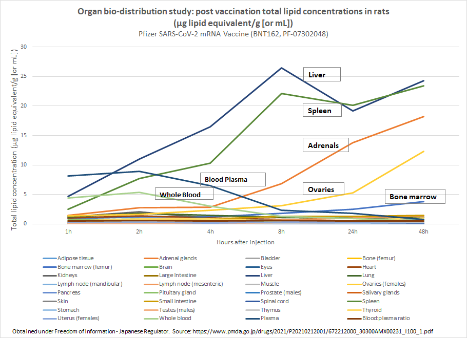

```{r setup, include=FALSE}
knitr::opts_chunk$set(echo = FALSE, message = FALSE, warning = FALSE)
library(tidyverse)
library(tabulizer)
```

```{r getting documents}
dir.create("trialsite_docs", showWarnings = FALSE)

download.file("https://trialsitenews.com/wp-content/uploads/2021/06/Ovaries-get-the-mRNA-from-Pfizer-Shot-Graph-1024x712.png",
              "trialsite_docs/original_image.png", 
              mode = "wb",
              quiet = TRUE
              )

download.file("https://preview.redd.it/u5i5hctrcq471.png?width=910&format=png&auto=webp&s=73f89a0fed4755cdb1dd199b2d6dc60a7b5c4f20",
              "trialsite_docs/revised_image.png", 
              mode= "wb",
              quiet = TRUE
              )

download.file("https://trialsitenews.com/wp-content/uploads/2021/06/Pfizer-report_Japanese-government.pdf",
              "trialsite_docs/report.pdf", 
              mode="wb",
              quiet = TRUE
              )
```

```{r extracting_table}

table <- extract_tables("trialsite_docs/report.pdf",
             output = "data.frame",
             pages = c(16,17), 
             # Found the areas ahead of time using locate_areas("trialsite_docs/report.pdf",pages = c(16,17))
             # I would have preferred a more programmatic way to identify the tables but this does get it done.
             area = list(
                       c(294.74247,  60.92308, 497.37793, 728.42809), 
                       c(167.59866,  66.22074, 517.24415, 742.99666)
                        ),
             guess = FALSE
             )

tbl = rbind(table[[1]], table[[2]])
columns = c("Tissue", "0.25h","1h","2h","4h","8h","24h","48h")

conc_tbl <- tbl[,1:8] %>% drop_na()
percent_tbl <- tbl[,c(1,9:15)] %>% drop_na()

colnames(conc_tbl)<-columns
colnames(percent_tbl)<-columns

percent_tbl = percent_tbl %>%
  mutate_at(vars(-Tissue), as.numeric,) %>%
  drop_na()
  
```

```{r wide_to_long}
percent_long = percent_tbl %>%
  pivot_longer(
    cols = ends_with("h"),
    names_to = "timepoint",
    values_to = "percentage"
  )

conc_long = conc_tbl %>%
  pivot_longer(
    cols = ends_with("h"),
    names_to = "timepoint",
    values_to = "concentration"
  )

percent_long$timepoint <- factor(percent_long$timepoint, levels=c("0.25h", "1h", "2h", "4h", "8h", "24h", "48h"))
conc_long$timepoint <- factor(conc_long$timepoint, levels=c("0.25h", "1h", "2h", "4h", "8h", "24h", "48h"))

```

Note: This post is tangentially related to the COVID-19 vaccines and will discuss an example (in my opinion) of a poorly constructed chart. This post is not seekig to make a value judgement on the claims made by the Steve Kirsch and instead focuses on data presentation (spoiler alert: I didn't love how it was done).

I was going through a post on trialsitenews.com titled "Should you get vaccinated?"(https://trialsitenews.com/should-you-get-vaccinated/) by Steve Kirsch and came across this graphic:


The quote below the caption of the image started with: "Biodistribution of lipid nanoparticles which carry the mRNA show that the ovaries get the highest concentration." The author provided a [link](https://trialsitenews.com/wp-content/uploads/2021/06/Pfizer-report_Japanese-government.pdf) to the original report used to generate this plot.<sup>see footnote</sup>

Because I am me, I opened the pdf up to take a look. Most of the document was in Japanese with some organic molecule structures but near the end were several tables in english with numbers that I understood. The table used to create the above graphic starts on the second page 6 (the document resets numbers after page 10, so it is actually the 16th page of the pdf document).

In reading the table I immediately notices that several of the measured locations were not included int the plot, including the injection site. If all of the data were plotted on the same chart, it would look like this:

```{r}
g <- ggplot(conc_long, aes(timepoint, concentration, group = Tissue)) + geom_point(aes(color=Tissue)) + geom_line(aes(color = Tissue))
g
```

The injection site being far and away the greatest concentration of LNP, which contradicts the chart and Kirsch's quote regarding it. But the goal I think of the chart was to point out that not all of the LNPs stay at the injection site, thus all of the other tissues tested, some of which are definitely not at zero concentraion.

Zooming in on these smaller concentrations displays other missing pieces (Note: This graphic eliminates the injection site and any data with a concentration less than 2 microgram/g (or mL). This was done to limit the number of colors in the graphic and to make it easier to match the Tissue to its corresponding line in the chart.)

```{r}
g <- ggplot(subset(conc_long, concentration < 100 & concentration > 2), aes(timepoint, concentration, group = Tissue)) + geom_point(aes(color=Tissue)) + geom_line(aes(color = Tissue))
g
```

Not only are the ovaries not the highest conentration outside of the injection site, they are not even on the podium (ovaries are in 4th place).

I will confess that I don't understand at what concentration the packages mRNA in the LNP becomes a significant issue in each tissue type I also have questions about where the signal detected could have been generate by remains of a degraded LNP and its contents but again do not fully understand the test. Broadly, I believe Kirsch's goal in the article was to highlight that the 1) LNP and accompanying package do not stay in a single location and 2) primarily deposits in the ovaries.

By closer examination, point 2 is not fully supported (amongst other Tissues it is prominent but not the highest concentration). Point 1 is supported in that some of the LNP does not stay at the injection site. The chart demonstrates this by showing concentrationso of the LNP tissue. 

Another consideration is the y-axis units. They are described as concetrations ("Mean total lipid concentration (μg lipid equivalent/g (or mL)") and thus appear to scale the LNP amount by the size of the tissue sampled. I have some questions about whether this is a good metric when considering where does the LNP accumulate, as a very small organ with one LNP could have a higher concentration than another site that is accumulating most of the LNP. This could also be why the injection site concentration is so high (what does the original paper's authors define as the volumne of the injection site?)

Luckily for us, the original paper actually has this information. Included in the same table is another column of time points labeled "% of administered dose". The data from this are displayed below:

```{r}
g <- ggplot(percent_long, aes(timepoint, percentage, group = Tissue)) + geom_point(aes(color=Tissue)) + geom_line(aes(color = Tissue))
g
```

Again the injection site has the highest amount of the LNP. The next most prominent site of LNP accumulation is the liver (about 15-20% of the total LNPs at later time points). It makes sense that large quantities would end up in the liver as it plays a role in de-toxifying blood (and because of its size it would not feature prominently in the concentration plot). But what I found most interesting was the fact that even the injection site was primarily in the 20-30% range. So where are the rest of the LNPs? Astute observers would notice that the list of tissues is shorter in this plot than in the previous. Much of those missing tissues have empty values for percentage of original dose, which in a footnote defines as "Not applicable, partial tissue taken". It appears then that the percentage values were only calculated for whole pieces of tissue. I am uncertain how they could then do multi-timepoint whole tissue/organ values but that could just be me not being familiar with the technique.

Taking the table as presented and summarizing the percentage data then we can get the following:

```{r percent_summary, echo=FALSE}
percent_tbl$type = ifelse(percent_tbl$Tissue == "Injection site","Injection site", 
                           ifelse(percent_tbl$Tissue == "Liver","Liver", "Other wholly tested tissue"
                                  )
                           )

percent_summary<- percent_tbl%>%
  select(-Tissue) %>%
  group_by(type) %>%
  summarise_all(sum)

percent_summary = rbind(percent_summary,c("Unaccounted for", 100-sum(percent_summary$`0.25h`), 100-sum(percent_summary$`1h`),sum(percent_summary$`2h`), 100-sum(percent_summary$`4h`), 100-sum(percent_summary$`8h`), 100-sum(percent_summary$`24h`), 100-sum(percent_summary$`48h`)))

summary_long = percent_summary %>%
  mutate_at(vars(-type), as.numeric,) %>%
  pivot_longer(
    cols = ends_with("h"),
    names_to = "timepoint",
    values_to = "percentage"
  )

g <- ggplot(summary_long, aes(timepoint, percentage, group = type)) + geom_point(aes(color=type)) + geom_line(aes(color = type))
g
```

I think this would get Kirsch's point across (the LNPs are going to places not the injection site) with minimal manipulation of the data in a non-deceptive manner.

Footnote:
Since I began thinking about the original chart, Kirsch has added some text attributing the plot to a group called PANDA and called out that values were left off of it. He also produced an additional plot (probably in response to people noticing what I did) here: 

The original image and text are still present in the article to check against my quotes and images. I commend him for updating his article with a more accurate image. I still think showing the percentage of LNP is useful in light of unknown toxicity.